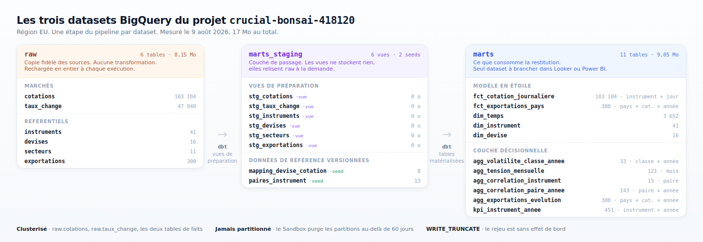

# Pipeline analytics — matières premières et devises

Collecte quotidienne de 41 instruments financiers et de 15 devises, structurés
en schéma en étoile puis agrégés en indicateurs.

```
Yahoo Finance ┐
Frankfurter   ├─► ingestion ─► BigQuery.raw ─► dbt ─► BigQuery.marts ─► BI
Banque Mondiale ┘
```

## Sources

| Source | Données | Fréquence | Clé |
|---|---|---|---|
| Yahoo Finance | 41 instruments, OHLCV | quotidienne | non |
| Frankfurter (BCE) | 15 devises | quotidienne | non |
| Banque Mondiale | exportations par pays | annuelle | non |

## Stack

Airflow · BigQuery · dbt Core · Power BI · Looker Studio

## Modèle

Granularité de la table de faits : **un instrument, un jour**.

```
dim_temps ┐
dim_instrument ├─► fct_cotation_journaliere
dim_devise ┘

fct_exportations_pays (grain distinct : pays × catégorie × année, non jointe)
```

Six tables d'agrégation complètent le modèle : volatilité par classe et par
année, tension mensuelle, corrélations société / matière première, évolution
des exportations, indicateurs annuels par instrument. Les chiffres du rapport
sortent de ces tables, pas de calculs refaits dans l'outil de restitution.



Maquette du tableau de bord, alimentée par les vraies données et prête à
reproduire : [docs/maquette/](docs/maquette/).
Dossier de rédaction du rapport : [docs/dossier-rapport.md](docs/dossier-rapport.md).

Détails et diagrammes : [docs/architecture.md](docs/architecture.md).
Questions métier et construction du tableau de bord :
[docs/questions-metier.md](docs/questions-metier.md).

## Exécution

Le workflow GitHub Actions est le seul déclencheur planifié, les jours ouvrés
à 18h37. Le DAG Airflow couvre le même périmètre en déclenchement manuel.
N'en planifier qu'un : ils écrivent les mêmes tables en `WRITE_TRUNCATE`.

## Lancer

Sans ordonnanceur :

```bash
pip install -r requirements.txt
python scripts/ingest.py          # remplit raw, puis contrôle ce qui est chargé
cd dbt_pipeline && dbt build      # construit marts et lance les tests
```

Avec Airflow, qui vit dans son propre environnement — ses versions de
`google-cloud-*` sont incompatibles avec celles de dbt :

```bash
python -m venv venv-airflow
./venv-airflow/bin/pip install -r requirements-airflow.txt \
  -c https://raw.githubusercontent.com/apache/airflow/constraints-2.9.3/constraints-3.12.txt
./lancer_airflow.sh               # interface sur http://localhost:8080
```
