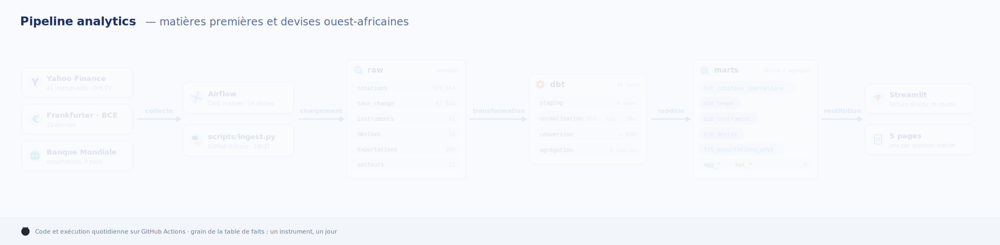
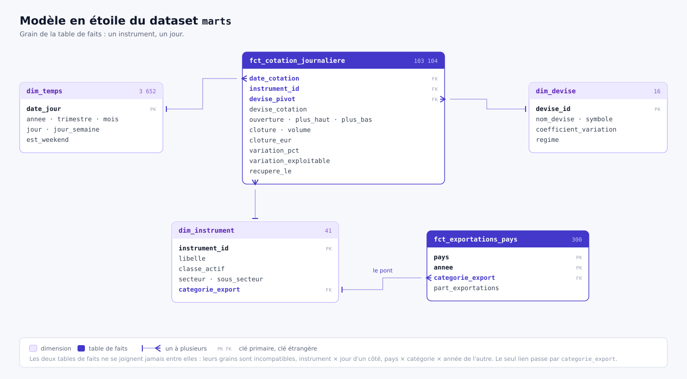

# Architecture



(version statique : `captures/01-architecture.png`)

## Sources

| Source | Contenu | Fréquence |
|---|---|---|
| Yahoo Finance | 41 instruments, OHLCV | quotidienne |
| Frankfurter (BCE) | 15 devises | quotidienne |
| Banque Mondiale | exportations par pays | annuelle |

Aucune ne demande de clé.

## Ingestion

Le DAG `ingest_market_data` tourne les jours ouvrés à 18h.

```
                ┌─ marches ──────────┐
                │   cotations        │
                │   taux             │
preparer ──────►┤                    ├──► controler_volumes
                │                    │            │
                ├─ referentiels ─────┤            ▼
                │   instruments      │    ┌─ transformation ─┐
                │   devises          │    │  deps            │
                │   secteurs         │    │  seed            │
                │   exportations     │    │  run_staging     │
                └────────────────────┘    │  run_marts       │
                                          │  run_analytique  │
                                          │  test            │
                                          │  docs            │
                                          └──────────────────┘
                                                   │
                                                   ▼
                                              recapituler
```

Les sources sont séparées en deux groupes : `marches` pour ce qui change chaque
jour, `referentiels` pour ce qui bouge rarement. `seed` charge la correspondance
des devises, dont dépend `fct_cotation_journaliere`, et les paires société /
matière première utilisées par les corrélations. `run_staging`, `run_marts` et
`run_analytique` sont distincts pour repérer tout de suite quelle couche casse.
`docs` produit la documentation navigable dans `dbt_pipeline/target/index.html`.

Chaque source est chargée par sa propre tâche : une panne côté Banque Mondiale
n'empêche pas les autres d'aboutir, et Airflow ne relance que celle qui a
échoué. `controler_volumes` interrompt le DAG si une table est vide, ou si un
instrument de la configuration n'a ramené aucune cotation. Ce second contrôle
compte les instruments réellement présents dans les lignes collectées : le
client Yahoo ignore les tickers en erreur et ne lève que si les 41 échouent,
donc sans lui une collecte réduite à quelques instruments passerait au vert.

L'échec de n'importe quelle tâche déclenche un mail. Les identifiants viennent
de `MBDA_SMTP_USER`, `MBDA_SMTP_PASSWORD` et `MBDA_SMTP_TO` ; sans eux
l'alerte est ignorée sans faire échouer la tâche.

Contenu de `raw` :

| Table | Lignes |
|---|---|
| `cotations` | 103 104 |
| `taux_change` | 47 040 |
| `instruments` | 41 |
| `devises` | 16 |
| `exportations` | 300 |
| `secteurs` | 11 |

Chaque exécution réécrit les tables entières (`WRITE_TRUNCATE`). Dix ans font
34 Mo, l'incrémental n'apporterait rien et le rejeu reste sans effet de bord.

`scripts/ingest.py` fait la même chose sans ordonnanceur, avec les mêmes
contrôles : les deux appellent `common/controles.py`.

## Les trois datasets


Une étape du pipeline par dataset, 17 Mo au total.

`raw` est la copie fidèle des sources, sans aucune transformation. `marts_staging`
contient six vues, qui ne stockent rien et relisent `raw` à la demande, plus les
deux seeds versionnés dans le dépôt. `marts` porte le modèle en étoile et la
couche décisionnelle, et c'est le **seul dataset à brancher dans un outil de
restitution**.

Une particularité à connaître : le Sandbox pose une expiration à 60 jours sur
chaque table, comptée depuis sa création. Les tables de `marts` sont recréées à
chaque `dbt run`, donc leur échéance recule à chaque exécution. Celles de `raw`
ne sont créées qu'une fois puis rechargées, et `WRITE_TRUNCATE` ne repousse pas
la date : `raw` expire avant `marts`. Le pipeline recrée la table à l'exécution
suivante, l'extraction étant complète rien n'est perdu, mais il faut avoir lancé
le pipeline pour que `raw` soit peuplée.

## Modèle



Grain de la table de faits : un instrument, un jour.

## Couche décisionnelle

`models/analytique/` porte les agrégations, les indicateurs et les comparaisons
dans le temps. Six tables, matérialisées dans `marts` à côté du modèle en
étoile pour que la restitution n'ait qu'un seul dataset à brancher.

| Table | Grain | Contenu |
|---|---|---|
| `agg_volatilite_classe_annee` | classe × année | écart-type et amplitude des variations |
| `agg_tension_mensuelle` | mois | dispersion mensuelle et seuil de tension |
| `agg_correlation_instrument` | paire | corrélation société / matière première |
| `agg_correlation_paire_annee` | paire × année | stabilité de cette corrélation |
| `agg_exportations_evolution` | pays × catégorie × année | écart en points d'une année à l'autre |
| `kpi_instrument_annee` | instrument × année | performance, volatilité, volume |

Les paires comparées viennent du seed `paires_instrument`, qui marque la paire
témoin Orange / Or. Un test singulier échoue si sa corrélation dépasse 0,15 :
le témoin ne mesure aucun lien réel, s'il se met à corréler c'est le calcul qui
est faux et les autres coefficients ne valent plus rien.

Le calcul est fait ici plutôt que dans l'outil de restitution, pour trois
raisons : les chiffres du rapport sont reproductibles, ils sont couverts par
les tests dbt, et le tableau de bord lit la colonne au lieu de recalculer sa
propre formule.

**Une convention à connaître.** `variation_pct` n'est un rendement que si les
deux clôtures comparées sont de même signe. Le WTI a coté -37,63 le 20 avril
2020, seule clôture négative de l'historique. La colonne `variation_exploitable`
de `fct_cotation_journaliere` marque ces lignes, elles restent dans la table, et
chaque agrégat publie `volatilite` avec et `volatilite_hors_anomalie` sans, plus
`observations_ecartees` pour dire combien. L'écart n'est pas anecdotique : avril
2020 passe de 12,29 à 4,72.

## À savoir

- Yahoo cote certains instruments en centimes (`USX`, `GBp`, `ZAc`) — `raw`
  garde la valeur brute, la division se fait dans dbt.
- Les devises ne sont pas toutes publiées le même jour, d'où des journées
  partielles dans `taux_change`.
- Le MRU n'existe que depuis janvier 2018.
- Le Sandbox interdit le DML et purge les partitions au-delà de 60 jours :
  chargement par lots, pas de partitionnement par date.

## Exécution automatique

Deux déclencheurs couvrent le même périmètre. Un seul doit être planifié à la
fois : ils écrivent les mêmes tables en `WRITE_TRUNCATE`, et deux exécutions
simultanées s'écraseraient l'une l'autre.

- **`.github/workflows/pipeline.yml`**, les jours ouvrés à 18h37. C'est le
  déclencheur actif, et il tourne sans machine allumée. Il enchaîne
  `scripts/ingest.py` puis `dbt build`, et envoie un mail si une étape échoue.
- **Le DAG `ingest_market_data`** (Airflow), en `schedule=None`, donc
  déclenchement manuel. Il couvre le même périmètre et sert à démontrer
  l'orchestration. Il suppose un Airflow lancé, d'où `demarrer.sh`, et un
  accès à `MBDA_KEYFILE`.

## Versions d'Airflow

Le DAG est vérifié sur **Airflow 2.9.3**, épinglé dans
`requirements-airflow.txt`. Il s'importe aussi sous Airflow 3.x, mais les deux
majeures ne sont pas interchangeables et l'écart s'est déjà manifesté deux
fois :

- `BashOperator` a quitté le coeur pour le provider `standard` en 3.0.
  L'import du DAG essaie les deux chemins.
- La clé `ts` a disparu du contexte passé aux callbacks en 3.x, ce qui
  empêchait l'alerte mail de partir (issue #14). `alerte.sur_echec` ne dépend
  plus du contexte pour l'horodatage.

Airflow ne figure pas dans `requirements.txt` et ne doit pas y entrer : ses
versions de `google-cloud-*` sont incompatibles avec celles de dbt, et ce
fichier sert au workflow GitHub Actions, qui n'a pas besoin d'ordonnanceur.
Les deux outils vivent dans des environnements séparés, raison pour laquelle
le DAG appelle dbt par un chemin explicite et jamais par le `PATH`.

Secrets à définir dans les paramètres du dépôt (pour le déclencheur GitHub
Actions) :

| Secret | Contenu |
|---|---|
| `GCP_SA_KEY` | clé de service BigQuery (JSON) |
| `MAIL_USER` | adresse Gmail d'envoi |
| `MAIL_PASSWORD` | mot de passe d'application Gmail |
| `MAIL_TO` | destinataires, séparés par des virgules |

Le mot de passe d'application se crée sur myaccount.google.com/apppasswords
et suppose la validation en deux étapes activée. Le mot de passe habituel ne
fonctionne pas.

## Régénérer les schémas

`docs/architecture.drawio` s'ouvre sur app.diagrams.net. Il s'exporte en PNG,
ou en GIF animé depuis `Fichier > Exporter > GIF animé`. Les images produites
vont dans `docs/captures/`.
