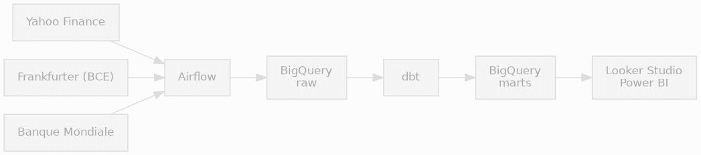
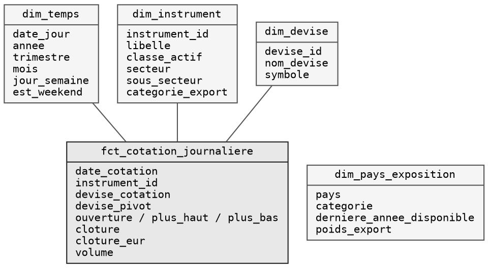

# Architecture



(version statique : `img/architecture.png`)

## Sources

| Source | Contenu | Fréquence |
|---|---|---|
| Yahoo Finance | 41 instruments, OHLCV | quotidienne |
| Frankfurter (BCE) | 15 devises | quotidienne |
| Banque Mondiale | exportations par pays | annuelle |

Aucune ne demande de clé.

## Ingestion

Le DAG `ingest_market_data` tourne les jours ouvrés à 18h.

```
                ┌─ marches ──────────┐
                │   cotations        │
                │   taux             │
preparer ──────►┤                    ├──► controler_volumes
                │                    │            │
                ├─ referentiels ─────┤            ▼
                │   instruments      │    ┌─ transformation ─┐
                │   devises          │    │  deps            │
                │   secteurs         │    │  seed            │
                │   exportations     │    │  run_staging     │
                └────────────────────┘    │  run_marts       │
                                          │  test            │
                                          │  docs            │
                                          └──────────────────┘
                                                   │
                                                   ▼
                                              recapituler
```

Les sources sont séparées en deux groupes : `marches` pour ce qui change chaque
jour, `referentiels` pour ce qui bouge rarement. `seed` charge la table de
correspondance des devises, dont dépend `fct_cotation_journaliere`. `run_staging`
et `run_marts` sont distincts pour repérer tout de suite quelle couche casse.
`docs` produit la documentation navigable dans `dbt_pipeline/target/index.html`.

Chaque source est chargée par sa propre tâche : une panne côté Banque Mondiale
n'empêche pas les autres d'aboutir, et Airflow ne relance que celle qui a
échoué. `controler_volumes` interrompt le DAG si une table est vide, ou si un
instrument de la configuration n'a ramené aucune cotation. Ce second contrôle
compte les instruments réellement présents dans les lignes collectées : le
client Yahoo ignore les tickers en erreur et ne lève que si les 41 échouent,
donc sans lui une collecte réduite à quelques instruments passerait au vert.

L'échec de n'importe quelle tâche déclenche un mail. Les identifiants viennent
de `MBDA_SMTP_USER`, `MBDA_SMTP_PASSWORD` et `MBDA_SMTP_TO` ; sans eux
l'alerte est ignorée sans faire échouer la tâche.

Contenu de `raw` :

| Table | Lignes |
|---|---|
| `cotations` | ~103 000 |
| `taux_change` | ~47 000 |
| `instruments` | 41 |
| `devises` | 16 |
| `exportations` | 300 |
| `secteurs` | 11 |

Chaque exécution réécrit les tables entières (`WRITE_TRUNCATE`). Dix ans font
34 Mo, l'incrémental n'apporterait rien et le rejeu reste sans effet de bord.

`scripts/ingest.py` fait la même chose sans ordonnanceur.

## Modèle



Grain de la table de faits : un instrument, un jour.

## À savoir

- Yahoo cote certains instruments en centimes (`USX`, `GBp`, `ZAc`) — `raw`
  garde la valeur brute, la division se fait dans dbt.
- Les devises ne sont pas toutes publiées le même jour, d'où des journées
  partielles dans `taux_change`.
- Le MRU n'existe que depuis janvier 2018.
- Le Sandbox interdit le DML et purge les partitions au-delà de 60 jours :
  chargement par lots, pas de partitionnement par date.

## Exécution automatique

Deux déclencheurs couvrent le même périmètre. Un seul doit être planifié à la
fois : ils écrivent les mêmes tables en `WRITE_TRUNCATE`, et deux exécutions
simultanées s'écraseraient l'une l'autre.

- **Le DAG `ingest_market_data`** (Airflow), planifié les jours ouvrés à 18h.
  C'est le déclencheur actif. Il couvre tout le pipeline, ingestion puis
  groupe `transformation`. Il suppose un Airflow lancé, d'où
  `lancer_airflow.sh`, et un accès à `MBDA_KEYFILE`.
- **`.github/workflows/pipeline.yml`**, réduit au déclenchement manuel
  (*Actions* puis *Run workflow*). Il enchaîne `scripts/ingest.py` puis
  `dbt build`, et envoie un mail si une étape échoue. Son bloc `schedule` est
  commenté dans le fichier : le remettre, et désactiver le DAG, pour une
  exécution autonome sans machine allumée.

## Versions d'Airflow

Le DAG est vérifié sur **Airflow 2.9.3**, épinglé dans
`requirements-airflow.txt`. Il s'importe aussi sous Airflow 3.x, mais les deux
majeures ne sont pas interchangeables et l'écart s'est déjà manifesté deux
fois :

- `BashOperator` a quitté le coeur pour le provider `standard` en 3.0.
  L'import du DAG essaie les deux chemins.
- La clé `ts` a disparu du contexte passé aux callbacks en 3.x, ce qui
  empêchait l'alerte mail de partir (issue #14). `alerte.sur_echec` ne dépend
  plus du contexte pour l'horodatage.

Airflow ne figure pas dans `requirements.txt` et ne doit pas y entrer : ses
versions de `google-cloud-*` sont incompatibles avec celles de dbt, et ce
fichier sert au workflow GitHub Actions, qui n'a pas besoin d'ordonnanceur.
Les deux outils vivent dans des environnements séparés, raison pour laquelle
le DAG appelle dbt par un chemin explicite et jamais par le `PATH`.

Secrets à définir dans les paramètres du dépôt (pour le déclencheur GitHub
Actions) :

| Secret | Contenu |
|---|---|
| `GCP_SA_KEY` | clé de service BigQuery (JSON) |
| `MAIL_USER` | adresse Gmail d'envoi |
| `MAIL_PASSWORD` | mot de passe d'application Gmail |
| `MAIL_TO` | destinataires, séparés par des virgules |

Le mot de passe d'application se crée sur myaccount.google.com/apppasswords
et suppose la validation en deux étapes activée. Le mot de passe habituel ne
fonctionne pas.

## Régénérer les schémas

Les diagrammes sont des pages HTML capturées avec Chrome en mode headless.

```bash
python docs/diagramme/frames.py   # architecture animée + version statique
python docs/diagramme/rendre.py   # modèle dimensionnel
```

`docs/diagramme/architecture.drawio` est une version éditable du même schéma :
elle s'ouvre sur app.diagrams.net et s'exporte en GIF animé depuis
`Fichier > Exporter > GIF animé`. Régénérée par `python docs/diagramme/drawio.py`.
