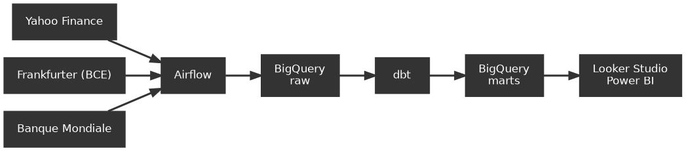

# Architecture

## Vue d'ensemble




Trois sources publiques alimentent un DAG Airflow quotidien, qui charge les
données brutes dans BigQuery. dbt les transforme en modèle dimensionnel,
exploité par les outils de restitution.

Deux règles structurent l'ensemble :

- **Aucune transformation dans `raw`** : les données y sont écrites telles que
  les API les renvoient, unités hétérogènes comprises. Toute correction relève
  de dbt.
- **Chaque exécution réécrit intégralement les tables** (`WRITE_TRUNCATE`, pas
  d'`INSERT` incrémental ni de purge). Le pipeline est donc idempotent :
  le rejouer aboutit au même état.

## Sources

| Source | Contenu | Fréquence | Clé |
|---|---|---|---|
| Yahoo Finance | 41 instruments, OHLCV | quotidienne | non |
| Frankfurter (BCE) | 14 devises, taux EUR | quotidienne | non |
| Banque Mondiale | 8 pays, parts d'exportations | annuelle | non |

## Le DAG

`ingest_market_data`, du lundi au vendredi à 18h00 (après clôture des marchés).

```
preparer ─┬─ cotations  ─┐
          ├─ taux       ─┼─ controler
          └─ references ─┘
```

Les trois collectes sont indépendantes : l'échec de l'une n'empêche pas les
autres d'aboutir.

Une exécution complète dure environ 90 secondes pour 34 Mo, soit 0,003 % du
quota mensuel de 1 To. À ce volume, un chargement incrémental serait plus
complexe sans être plus rapide.

## Base de données

### `raw` — état actuel

| Table | Lignes | Source |
|---|---|---|
| `cotations` | 103 104 | Yahoo Finance |
| `taux_change` | 43 382 | Frankfurter |
| `instruments` | 41 | configuration du projet |
| `devises` | 14 | Frankfurter `/v2/currencies` |
| `exportations` | 300 | Banque Mondiale `TX.VAL.*` |
| `secteurs` | 11 | correspondance secteur → catégorie |

```
cotations                        taux_change
├─ date_cotation    DATE         ├─ date_taux      DATE
├─ instrument_id    STRING ─┐    ├─ devise_base    STRING
├─ ouverture        FLOAT   │    ├─ devise_cible   STRING ─┐
├─ plus_haut        FLOAT   │    ├─ taux           FLOAT   │
├─ plus_bas         FLOAT   │    └─ recupere_le    TS      │
├─ cloture          FLOAT   │                              │
├─ volume           INTEGER │    devises                   │
├─ devise_cotation  STRING  │    ├─ devise_id      STRING ◀┘
└─ recupere_le      TS      │    ├─ libelle        STRING
                            │    ├─ symbole        STRING
instruments                 │    ├─ publiee_depuis DATE
├─ instrument_id    STRING ◀┘    └─ publiee_jusqua DATE
├─ libelle          STRING
├─ classe_actif     STRING       exportations
├─ secteur          STRING ─┐    ├─ pays               STRING
└─ sous_secteur     STRING  │    ├─ annee              INTEGER
                            │    ├─ categorie          STRING ─┐
secteurs                    │    └─ part_exportations  FLOAT   │
├─ secteur          STRING ◀┘                                  │
└─ categorie_export STRING ◀───────────────────────────────────┘
```

### `marts` — modèle à construire


**Deux tables de faits partageant des dimensions conformes** (constellation),
et non une étoile unique : les deux grains sont incompatibles.

| Table de faits | Grain |
|---|---|
| `fct_cotation_journaliere` | instrument × **jour** |
| `fct_exportations_pays` | pays × catégorie × **année** |

| Table cible | Construite depuis |
|---|---|
| `fct_cotation_journaliere` | `cotations` + `taux_change` |
| `fct_exportations_pays` | `exportations` |
| `dim_temps` | dérivée des dates |
| `dim_instrument` | `instruments` |
| `dim_devise` | `devises` + `taux_change` |
| `dim_secteur` | `secteurs` |

**Ne jamais joindre `exportations` directement aux cotations.** Les libellés ne
correspondent pas (`Metaux` côté exportations contre `Metaux precieux` et
`Metaux industriels` côté instruments) : une jointure sur le libellé perdrait
silencieusement deux catégories sur quatre et multiplierait les autres par le
nombre d'instruments du secteur. `dim_secteur` déclare la correspondance N:1 de
façon explicite et testable.

## Points d'attention pour la transformation

**Unités de cotation.** Yahoo cote 12 instruments en centimes : `USX` (cents
américains), `GBp` (pence), `ZAc` (cents sud-africains). Sans division par 100,
Anglo American à 83 823 passe pour l'action la plus chère de la table. La
devise brute est conservée dans `cotations.devise_cotation`.

**Journées de taux incomplètes.** Les devises ne sont pas publiées
simultanément — certaines journées n'en contiennent qu'une partie. `raw` les
conserve telles quelles ; le filtrage relève du staging.

**MRU avant 2018.** Le nouvel ouguiya n'existe que depuis le 2 janvier 2018.
Son absence sur les années antérieures est normale, ce n'est pas un trou de
données.

**Régime de change.** Volontairement non déclaré en base : il se dérive de la
variance observée des taux, ce qui évite une classification manuelle erronée.

Utiliser un **seuil sur le coefficient de variation**, pas une égalité stricte.
Sur les données actuelles, XOF et CVE ont un écart-type exactement nul (une
seule valeur distincte sur plus de 2 500 jours, la BCE publiant le taux arrimé
comme une constante), mais le MAD à 1,99 % relève d'un panier — ni arrimé, ni
franchement flottant. Un seuil rend la classification plus honnête et résiste
mieux à l'arrivée de nouvelles devises.

Le régime peut aussi **changer dans le temps** : le MRU a été redénominé en
2018, le NGN a connu plusieurs dévaluations. Une variance calculée sur dix ans
lisse ces ruptures ; une fenêtre glissante annuelle serait plus fidèle si
l'analyse porte sur l'évolution des régimes.

## Contraintes BigQuery Sandbox

Le mode gratuit interdit les instructions DML et l'insertion en flux continu :
le chargement se fait donc par lots.

Les tables expirent après 60 jours. Le DAG les recrée au passage suivant, ce
qui rend le pipeline auto-réparant tant qu'il tourne.

Toute partition de plus de 60 jours est supprimée automatiquement, et ce
comportement ne peut pas être désactivé — d'où l'absence de partitionnement par
date métier, qui réduirait l'historique aux deux derniers mois. Les tables sont
clusterisées à la place.

## Régénérer les schémas

```bash
python docs/schemas.py
```
