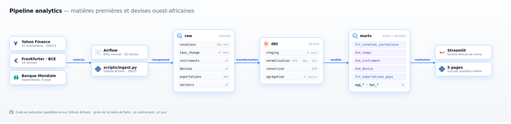
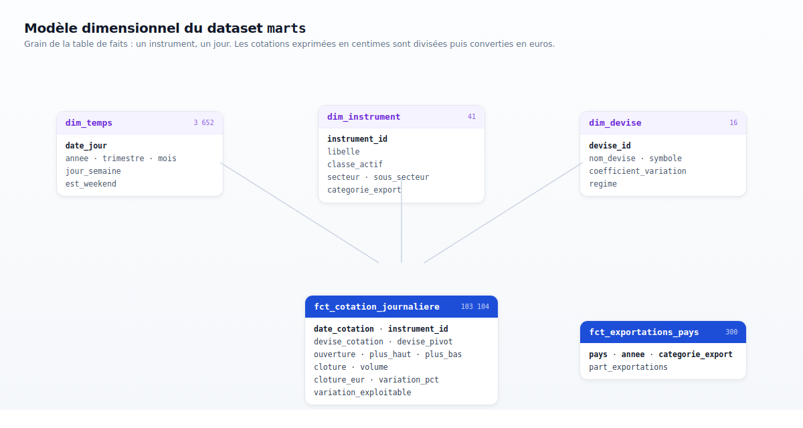

# Dossier de rédaction du rapport

Tout ce qu'il faut pour écrire les 10 à 15 pages, rassemblé ici. Chaque chiffre
de ce document a été mesuré sur les données réelles, pas estimé. Quand un chiffre
est cité, la table qui le produit est nommée à côté, pour qu'on puisse le
revérifier ou répondre à une question de jury.

État arrêté au **9 août 2026**, dépôt à jour sur `main`.

---

## 1. Comment utiliser ce dossier

Les sections 3 à 11 suivent l'ordre d'un rapport classique. Chacune donne la
matière factuelle, les justifications des choix, et les chiffres. Il reste à
rédiger, pas à chercher.

La section 12 récapitule tous les chiffres citables au même endroit.
La section 13 dit quelle capture d'écran va dans quelle section.
La section 14 liste ce qu'il ne faut **pas** écrire, parce que c'est faux ou
parce que ça a déjà été corrigé.

Trois documents complètent celui-ci dans le dépôt :

| Fichier | Contenu |
|---|---|
| `docs/architecture.md` | l'architecture technique en détail |
| `docs/questions-metier.md` | les 5 questions et la construction du tableau de bord |
| `CLAUDE.md` | les décisions et les pièges, version courte |

---

## 2. Fiche d'identité

| | |
|---|---|
| **Module** | Bases de Données Multidimensionnelles |
| **Formation** | Master 1 MBDA, UN-CHK |
| **Équipe** | Ibrahima Gabar Diop, Ndeye Sokhna Nokho, Isselmou |
| **Période** | 1er au 9 août 2026 |
| **Dépôt** | `github.com/Gblack98/mbda-projet2-pipeline`, public |
| **Entrepôt** | Google BigQuery, projet `crucial-bonsai-418120`, région EU |
| **Sujet** | Matières premières, devises et exposition des exportations ouest-africaines |

**Volumétrie du projet** : 56 commits, 17 issues et pull requests, 531 lignes de
Python, 482 lignes de SQL, 420 lignes de YAML, 586 lignes de documentation.

---

## 3. Le sujet et la problématique

Le projet mesure le lien entre les **marchés de matières premières** et les
**économies ouest-africaines**, à travers deux canaux : le régime de change des
monnaies de la région, et la composition du panier d'exportation de chaque pays.

La question qui porte le sujet est la première : **le régime de change protège-t-il
de la volatilité ?** Les monnaies arrimées à l'euro devraient afficher une
variabilité nulle face à lui, les monnaies flottantes une variabilité forte. Les
données le confirment sans ambiguïté, et l'écart est spectaculaire : de 0,000 pour
le franc CFA à 0,721 pour le naira nigérian.

Quatre questions secondaires complètent le tableau : quelle classe d'actif est la
plus volatile, quel pays a le panier d'exportation le plus exposé, les sociétés
extractives suivent-elles le cours de leur matière première, et quelles ont été
les périodes de tension sur dix ans.

**Pourquoi ce sujet se prête au décisionnel** : les données ont deux grains
naturellement différents, quotidien pour les marchés et annuel pour les
exportations, ce qui oblige à un vrai travail de modélisation dimensionnelle
plutôt qu'à une simple table à plat.

---

## 4. Les sources de données

Trois sources publiques, aucune ne demande de clé d'API, ce qui rend le projet
reproductible par n'importe qui.

| Source | Contenu | Fréquence | Volume chargé |
|---|---|---|---|
| **Yahoo Finance** | 41 instruments, cours OHLCV quotidiens | quotidienne | 103 104 lignes |
| **Frankfurter (BCE)** | 15 devises face à l'euro | quotidienne | 47 040 lignes |
| **Banque Mondiale** | part des catégories dans les exportations | annuelle | 300 lignes |

**Les 41 instruments** se répartissent en trois classes : 23 matières premières
(agricoles, céréales, énergie, métaux précieux, métaux industriels, élevage),
13 actions de sociétés extractives et un témoin, 5 indices boursiers.

**Les 15 devises** couvrent l'Afrique de l'Ouest (XOF, MRU, NGN, GHS, GMD, CVE),
les grandes monnaies de référence (USD, GBP, JPY, CNY, CAD) et le reste du
continent (ZAR, MAD, EGP, KES). L'euro s'ajoute dans la dimension sans avoir de
cours, puisqu'il est la base.

**Les 8 pays** sont le Sénégal, la Mauritanie, le Nigeria, le Ghana, la Côte
d'Ivoire, le Mali, le Burkina Faso et le Bénin.

**Profondeur** : dix ans, du 8 août 2016 au 7 août 2026.

### Pièges rencontrés sur les sources

Ces trois points méritent un paragraphe dans le rapport, ils montrent que les
données ont été regardées et pas seulement téléchargées.

**Yahoo change de granularité selon le paramètre.** Demander `range=max` renvoie
des cours **mensuels**, pas quotidiens. Il faut demander explicitement `10y` pour
obtenir du journalier. Une lecture rapide de la réponse aurait donné un jeu 20 fois
plus petit sans message d'erreur.

**Certains instruments cotent en sous-unités.** `USX`, `GBp` et `ZAc` sont des
centimes, pas des unités. L'action Anglo American cote en centimes de rand, le
sucre en centimes de dollar. Sans division par 100, ces instruments apparaissent
cent fois plus chers. Le choix a été de **garder la valeur brute dans `raw`** et
de faire la division dans dbt, à partir d'une table de correspondance versionnée.

**Le MRU n'existe que depuis janvier 2018.** L'ouguiya mauritanien a été
redénominé à cette date. Un filtre qui exigeait la présence de toutes les devises
chaque jour écartait 43 % de l'historique. La règle retenue : `raw` reste une
copie fidèle, le filtrage appartient à la couche de transformation.

---

## 5. L'architecture technique



Le pipeline suit trois étapes, une par dataset BigQuery.


### `raw`, la copie fidèle

Six tables remplies directement par du Python, sans aucune transformation.
8,15 Mo. La règle est stricte : `raw` n'interprète pas, il enregistre. Les
centimes restent des centimes, les devises manquantes restent manquantes.

### `marts_staging`, la couche de passage

Six **vues** et deux **seeds**. Les vues ne stockent rien, elles relisent `raw`
au moment où on les interroge, d'où leur taille de 0 octet. Leur rôle est d'être
le seul endroit du projet qui touche aux sources : si Yahoo renomme un champ, la
correction se fait à un seul endroit.

Les seeds sont des données de référence saisies à la main et versionnées en CSV
dans le dépôt : `mapping_devise_cotation` (8 lignes) qui dit que `USX` vaut `USD`
divisé par 100, et `paires_instrument` (13 lignes) qui liste les paires société /
matière première comparées.

### Le tableau de bord

Une application **Streamlit** en Python, dans `dashboard/`, qui lit `marts` en
direct avec un compte de service en lecture seule.

Le choix se justifie en trois points, à donner dans le rapport :

- **Un seul outil, sous Linux.** Les alternatives classiques imposaient soit un
  poste Windows, soit un export intermédiaire.
- **Le tableau de bord devient du code.** Il est versionné dans le dépôt, relu
  en pull request et déployé comme le reste du projet. C'était la seule partie
  qui aurait vécu en dehors de Git.
- **La démonstration en direct devient possible.** Déclencher le pipeline
  pendant la soutenance et voir la donnée du jour apparaître à l'écran, sans
  rien rafraîchir à la main.

Le compte de service utilisé ne peut ni écrire, ni lire `raw`, ni lire
`marts_staging`. C'est vérifiable en une commande, et cela vaut d'être montré :
un tableau de bord n'a aucune raison d'avoir plus de droits que la lecture des
tables finales.

### `marts`, ce que consomme la restitution

Onze tables, 9,05 Mo, en deux familles : le modèle en étoile et la couche
décisionnelle. **C'est le seul dataset que lit le tableau de bord.**

### Un choix à défendre : le rechargement complet

À chaque exécution, les tables sont réécrites entièrement en `WRITE_TRUNCATE`
plutôt que mises à jour de façon incrémentale.

La justification est chiffrée : dix ans de données font 34 Mo et l'extraction
complète prend 93 secondes. Un pipeline incrémental aurait ajouté de la
complexité (gestion des reprises, détection des lignes déjà chargées, gestion des
corrections rétroactives des sources) pour un gain nul. En prime, le rejeu devient
inoffensif : relancer deux fois de suite ne crée aucun doublon.

### Les contraintes du mode Sandbox de BigQuery

Le projet tourne sur le palier gratuit de BigQuery, ce qui impose trois limites
qui ont réellement changé la conception.

**Le Sandbox supprime toute partition de plus de 60 jours**, et cette purge ne
peut pas être désactivée. La conséquence est contre-intuitive : **il ne faut pas
partitionner par date métier**. Une table partitionnée sur `date_cotation`
perdrait automatiquement tout l'historique au-delà de deux mois, c'est-à-dire
l'essentiel du sujet. Les tables sont donc non partitionnées mais **clusterisées**,
ce qui donne le même bénéfice de filtrage sans le risque.

**Pas de DML ni de streaming.** Ni `UPDATE`, ni `DELETE`, ni insertion ligne à
ligne. Seul le chargement par lots est autorisé, ce qui a orienté vers le
`WRITE_TRUNCATE`.

**Les tables entières expirent à 60 jours** après leur création. Les tables de
`marts` sont recréées à chaque exécution de dbt, donc leur échéance recule sans
cesse. Celles de `raw` ne sont créées qu'une fois puis rechargées, et le
rechargement ne repousse pas la date : `raw` expire donc avant `marts`. Le
pipeline se répare seul à l'exécution suivante puisque l'extraction est complète.

---

## 6. Le modèle dimensionnel



**Grain de la table de faits : un instrument, un jour.** C'est le grain le plus
fin disponible dans la source, et il permet toutes les agrégations utiles :
par semaine, par mois, par année, par classe d'actif, par secteur.

### Les tables

| Table | Lignes | Rôle |
|---|---|---|
| `fct_cotation_journaliere` | 103 104 | table de faits, instrument × jour |
| `dim_temps` | 3 652 | calendrier, du 8 août 2016 au 7 août 2026 |
| `dim_instrument` | 41 | hiérarchie classe → secteur → sous-secteur |
| `dim_devise` | 16 | devises, avec régime de change dérivé |
| `fct_exportations_pays` | 300 | seconde table de faits, grain annuel |

### Trois décisions à expliquer dans le rapport

**Le calendrier est dérivé des données, pas écrit en dur.** `dim_temps` était au
départ construit sur `generate_date_array('2016-01-01', current_date())`, avec une
borne basse en dur. Elle vient maintenant du minimum réellement présent dans les
cotations. Le calendrier s'aligne donc automatiquement sur les données, et il n'y
a jamais de jour de dimension sans fait correspondant.

**Le régime de change est calculé, pas saisi.** `dim_devise.regime` vient du
coefficient de variation du taux face à l'euro : arrimé sous 0,005, géré sous
0,10, flottant au-delà. Saisir ces régimes à la main aurait été plus simple mais
aurait supposé de connaître la réponse d'avance, ce qui vide la question de son
intérêt. Le dirham marocain suit un panier de devises et n'est ni vraiment arrimé
ni vraiment flottant : c'est exactement le cas qu'un seuil calculé tranche mieux
qu'une opinion.

**Il y a deux tables de faits, et elles ne se joignent jamais directement.** Les
grains sont incompatibles : instrument × jour d'un côté, pays × catégorie × année
de l'autre. Les joindre produirait un produit cartésien qui gonflerait
artificiellement toutes les mesures. Le lien passe par l'attribut
`categorie_export`, présent des deux côtés, qui rattache le secteur d'un
instrument à une catégorie d'exportation de la Banque Mondiale.

C'est le point de modélisation le plus intéressant du projet et il mérite un
schéma dans le rapport.

---

## 7. La couche décisionnelle

Six tables d'agrégation, une ou deux par question métier. Elles sont calculées
**dans le pipeline**, pas dans l'outil de restitution.

| Table | Grain | Lignes | Question |
|---|---|---|---|
| `agg_volatilite_classe_annee` | classe × année | 33 | 2 |
| `agg_tension_mensuelle` | mois | 121 | 5 |
| `agg_correlation_instrument` | paire | 13 | 4 |
| `agg_correlation_paire_annee` | paire × année | 143 | 4 |
| `agg_exportations_evolution` | pays × catégorie × année | 300 | 3 |
| `kpi_instrument_annee` | instrument × année | 451 | 2 et 5 |

**Pourquoi calculer ici plutôt que dans le tableau de bord**, trois raisons à
donner dans le rapport :

1. **Les chiffres du rapport deviennent reproductibles.** Un chiffre obtenu par
   une requête lancée une fois dans une console ne se revérifie pas. Un chiffre
   produit par un modèle versionné se recalcule à volonté.
2. **Ils sont couverts par les tests.** Une agrégation faite dans l'outil de
   restitution n'est testée par rien.
3. **Le rapport et l'écran affichent la même valeur.** Le tableau de bord lit
   la colonne, il ne la recalcule pas, donc les deux ne peuvent pas diverger.

### Les indicateurs calculés

| Indicateur | Où | Définition |
|---|---|---|
| `variation_pct` | table de faits | variation en % par rapport à la clôture précédente |
| `cloture_eur` | table de faits | clôture convertie en euros, après division des centimes |
| `coefficient_variation` | `dim_devise` | écart-type du taux divisé par sa moyenne |
| `regime` | `dim_devise` | arrimé, géré, flottant ou référence, selon le coefficient |
| `volatilite` | agrégats | écart-type d'échantillon des variations quotidiennes |
| `amplitude_moyenne` | agrégats | moyenne des variations en valeur absolue |
| `correlation` | agrégats | coefficient de Pearson entre deux séries de variations |
| `performance_pct` | `kpi_instrument_annee` | rendement annuel en devise de cotation |
| `ecart_points` | `agg_exportations_evolution` | écart de part avec l'année précédente, en points |

**Une convention à énoncer une fois dans le rapport et à tenir ensuite** : la
volatilité se mesure sur `variation_pct`, jamais sur les prix. Un écart-type de
prix comparerait Kosmos Energy, qui cote autour de 2 euros, et Anglo American, qui
cote autour de 800, et conclurait que la seconde est 400 fois plus volatile alors
qu'elle ne fait que coter plus cher.

L'écart-type retenu partout est celui **d'échantillon**, `STDDEV` en BigQuery,
`STDEV.S` en tableur. C'est celui qui produit les chiffres cités ici.

---

## 8. La qualité et les tests

Trois niveaux de contrôle, 81 tests automatiques au total.

**13 tests Python** (`pytest`) sur la logique pure : unicité des tickers,
complétude de la hiérarchie des instruments, absence de partitionnement dans les
schémas, et les fonctions de contrôle de volumes.

**68 tests dbt** sur les données elles-mêmes :

| Type | Nombre | Ce qu'il vérifie |
|---|---|---|
| `not_null` | 41 | aucune valeur manquante sur les colonnes obligatoires |
| `relationships` | 8 | intégrité référentielle entre faits et dimensions |
| `unique` | 7 | pas de doublon sur les clés simples |
| `unique_combination_of_columns` | 6 | le grain déclaré est bien le grain réel |
| `accepted_values` | 3 | les valeurs appartiennent à une liste fermée |
| `accepted_range` | 2 | les corrélations restent entre -1 et 1 |
| test singulier | 1 | la corrélation témoin reste sous 0,15 |
| **total** | **68** | |

**Deux contrôles bloquants dans le pipeline**, avant la transformation : aucune
table ne doit être vide, et chaque instrument de la configuration doit avoir
ramené au moins une cotation.

### Le test le plus intéressant du projet

Le **test témoin**. La paire Orange / Or ne mesure aucun lien économique : un
opérateur télécom français n'a rien à voir avec le cours de l'or. Sa corrélation
doit donc rester proche de zéro, et elle vaut 0,043.

Un test dbt échoue si elle dépasse 0,15. Son intérêt : si quelqu'un casse le
calcul de corrélation plus tard, par exemple en joignant mal les dates, toutes
les corrélations monteraient ensemble et **le témoin le dirait**. Sans lui, un
0,6 pour Kinross pourrait être un artefact de calcul, et rien ne le distinguerait
d'un vrai résultat.

C'est le point à développer si le rapport doit montrer une démarche scientifique
et pas seulement technique.

---

## 9. L'orchestration

Deux chemins d'exécution couvrant le même périmètre, dont **un seul est planifié**
à la fois : ils écrivent les mêmes tables en `WRITE_TRUNCATE`, deux exécutions
simultanées s'écraseraient.

**GitHub Actions**, les jours ouvrés à 18h37, c'est le déclencheur actif. Il
tourne sans machine allumée. Il enchaîne `scripts/ingest.py` puis `dbt build`, et
envoie un courriel si une étape échoue.

**Le DAG Airflow**, en déclenchement manuel, 16 tâches en trois groupes. Il sert à
démontrer l'orchestration et il est utilisé pour la soutenance.

```
                ┌─ marches ──────────┐
                │   cotations        │
                │   taux             │
preparer ──────►┤                    ├──► controler_volumes
                │                    │            │
                ├─ referentiels ─────┤            ▼
                │   instruments      │    ┌─ transformation ─┐
                │   devises          │    │  deps            │
                │   secteurs         │    │  seed            │
                │   exportations     │    │  run_staging     │
                └────────────────────┘    │  run_marts       │
                                          │  run_analytique  │
                                          │  test            │
                                          │  docs            │
                                          └──────────────────┘
                                                   │
                                                   ▼
                                              recapituler
```

**Pourquoi chaque source a sa propre tâche** : une panne de l'API de la Banque
Mondiale n'empêche pas les autres chargements d'aboutir, et Airflow ne relance que
la tâche qui a échoué, pas tout le pipeline.

**Pourquoi les étapes dbt sont séparées** : quand quelque chose casse, on voit
immédiatement quelle couche est en cause, staging, modèle ou agrégats.

**Performance mesurée** sur une exécution complète du 9 août : 3 minutes 25 au
total, dont 93 secondes d'ingestion et 30 secondes de transformation dbt.

**Alertes** : l'échec de n'importe quelle tâche déclenche un courriel. Les
identifiants passent par des variables d'environnement, jamais par le code.

### Une contrainte à mentionner honnêtement

Aucun ordonnanceur cloud gratuit n'était accessible sans carte bancaire. GitLab
exige une carte pour ses runners partagés depuis 2021, Cloudflare Workers coupe
à 30 secondes, Oracle Cloud demande une carte. GitHub Actions a fini par être la
solution, et Airflow tourne en local. La consigne n'exigeait aucun hébergement.

À noter pour la rigueur : GitHub met les workflows planifiés en file d'attente
quand la charge est forte. Une exécution déclenchée à 18h59 le 7 août n'a démarré
que le lendemain à 11h09, soit 16 heures plus tard. Le cron a été décalé à 18h37
pour éviter le début d'heure, qui est le moment le plus chargé.

---

## 10. Les résultats, question par question

### Question 1 — Le régime de change protège-t-il de la volatilité ?

**Source** : `dim_devise`. **Réponse : oui, et l'écart est total.**

| Devise | Coefficient de variation | Régime |
|---|---|---|
| XOF (franc CFA) | 0,000 | arrimé |
| CVE (escudo cap-verdien) | 0,000 | arrimé |
| MAD (dirham marocain) | 0,020 | géré |
| GBP (livre sterling) | 0,024 | géré |
| CAD (dollar canadien) | 0,046 | géré |
| USD (dollar américain) | 0,048 | géré |
| MRU (ouguiya mauritanien) | 0,058 | géré |
| NGN (naira nigérian) | 0,721 | flottant |

Le franc CFA affiche **une seule valeur distincte sur 2 579 jours** : 655,957
francs pour un euro, invariable. C'est la définition même d'un arrimage.

Le naira est trente fois plus variable que l'ouguiya et infiniment plus que le
franc CFA.

**Une limite à signaler dans le rapport, elle sera bien vue.** Le coefficient
mesure la variabilité face à l'euro, pas une politique monétaire. Il classe donc
le dollar, la livre et le dollar canadien en « géré » alors que ces monnaies
flottent librement : elles sont simplement peu volatiles face à l'euro. Le
classement est exact du point de vue de la mesure et discutable du point de vue
économique. Le dire vaut mieux que de le laisser trouver.

### Question 2 — Quelle classe d'actif est la plus volatile ?

**Source** : `agg_volatilite_classe_annee`. **Réponse : les indices.**

| Classe | Instruments | Volatilité | Hors anomalie |
|---|---|---|---|
| Indices | 5 | 3,98 | 3,98 |
| Matières premières | 23 | 2,61 | 2,22 |
| Actions | 13 | 2,47 | 2,47 |

Les indices dominent pour une raison qu'il faut expliquer : **le VIX en fait
partie**. Le VIX est l'indice de la volatilité implicite du S&P 500, autrement dit
un instrument dont la nature même est de bouger fort. Sans lui, les indices
seraient les plus calmes des trois classes. C'est un bon exemple de résultat qui
demande de connaître ses données pour être interprété.

### Question 3 — Quel pays a le panier d'exportation le plus exposé ?

**Source** : `agg_exportations_evolution`. **Réponse : le Nigeria, et de très
loin.** Résultats 2024, catégorie dominante de chaque pays :

| Pays | Catégorie dominante | Part |
|---|---|---|
| **Nigeria** | **Énergie** | **88,6 %** |
| Bénin | Agricoles | 52,9 % |
| Côte d'Ivoire | Alimentaire | 47,2 % |
| Mauritanie | Métaux | 33,7 % |
| Sénégal | Énergie | 32,7 % |

Le Nigeria dépend de l'énergie à 88,6 %, un niveau de concentration sans
équivalent dans l'échantillon. La Mauritanie est exposée au minerai de fer et à
l'or, le Sénégal à l'énergie depuis la mise en production du champ de Sangomar :
sa part énergie passe de 19,7 % en 2023 à 32,7 % en 2024.

La table donne aussi `ecart_points`, l'évolution d'une année sur l'autre. À citer
en points et non en pourcentage : `part_exportations` est déjà un pourcentage, et
écrire « l'énergie gagne 4,2 % » quand elle gagne 4,2 points est une erreur
classique.

### Question 4 — Les sociétés extractives suivent-elles leur matière ?

**Source** : `agg_correlation_instrument`. **Réponse : oui, et le classement est
parfaitement lisible.**

| Paire | r |
|---|---|
| Barrick / Or | 0,655 |
| Newmont / Or | 0,624 |
| Kinross / Or | 0,618 |
| Endeavour / Or | 0,546 |
| Exxon Mobil / Brent | 0,534 |
| BP / Brent | 0,528 |
| Woodside / Brent | 0,504 |
| Shell / Brent | 0,482 |
| Glencore / Cuivre | 0,480 |
| TotalEnergies / Brent | 0,471 |
| Anglo American / Cuivre | 0,455 |
| Kosmos Energy / Gaz | 0,087 |
| **Orange / Or (témoin)** | **0,043** |

Le classement se lit tout seul : les trois plus gros producteurs d'or occupent les
trois premières places, les pétrolières suivent entre 0,47 et 0,53, les
diversifiées du cuivre viennent après, et le témoin ferme la marche.

Kosmos Energy à 0,087 s'explique : la société exploite du gaz qui ne se vend pas
au prix de la référence américaine utilisée ici.

### Question 5 — Quelles ont été les périodes de tension ?

**Source** : `agg_tension_mensuelle`. Médiane historique : 2,34. Seuil de tension
à trois fois la médiane, soit 7,02.

| Mois | Volatilité | Hors anomalie | Tension |
|---|---|---|---|
| avril 2020 | 12,30 | 4,74 | oui |
| mars 2020 | 7,17 | 7,17 | oui |
| février 2018 | 4,91 | 4,91 | non |
| avril 2025 | 4,28 | 4,28 | non |
| janvier 2026 | 4,15 | 4,15 | non |

Deux mois seulement dépassent le seuil sur dix ans, tous les deux au premier
trimestre 2020.

**Le pic d'avril 2020 demande une explication précise**, elle est développée en
section 11.

---

## 11. Les deux incidents, et ce qu'ils apprennent

C'est la partie la plus intéressante du rapport. Elle montre une démarche
critique, ce qui distingue un travail d'étudiant d'un travail sérieux. Les deux
incidents ont été trouvés **après** que le pipeline fonctionnait et que tous les
tests passaient.

### Incident 1 — Un prix négatif casse la notion de rendement

Le 20 avril 2020, le pétrole WTI a coté **-37,63 dollars**. C'est un événement
réel : les capacités de stockage étaient saturées et les détenteurs de contrats
payaient pour s'en débarrasser.

Or `variation_pct` se calcule par `clôture / clôture précédente - 1`. Quand le
signe change, ce calcul n'a plus de sens : il produit **-306 %** ce jour-là, puis
**-127 %** le lendemain. Une baisse de plus de 100 % est une impossibilité
mathématique pour un rendement.

Ces deux lignes, sur 103 104, portent à elles seules le record d'avril 2020 :
**12,30 avec, 4,74 sans**. En les écartant, avril 2020 passe **derrière** mars
2020. Autrement dit, le mois le plus agité du krach Covid est mars, et avril est
le mois de l'anomalie de prix. Ce sont deux faits différents.

**La correction retenue** : ne rien supprimer. Une colonne booléenne
`variation_exploitable` marque ces lignes, elles restent dans la table, et chaque
table d'agrégation publie deux colonnes, `volatilite` et
`volatilite_hors_anomalie`, plus `observations_ecartees` qui dit combien de lignes
sont concernées.

**La leçon à écrire** : masquer une valeur aberrante aurait été plus simple et
aurait fait disparaître un fait réel. Publier les deux mesures laisse le lecteur
juger, à condition de toujours dire laquelle on cite.

### Incident 2 — Un symbole boursier change de société

L'analyse par paires donnait Barrick à **0,215** de corrélation avec l'or, en bas
du tableau, très loin de Kinross et Newmont autour de 0,62. L'explication
plausible était la diversification de Barrick au-delà de l'or.

Le découpage annuel, table `agg_correlation_paire_annee`, a montré autre chose :
un coefficient bloqué autour de **0,1 pendant six ans**, de 2016 à 2021, puis une
montée régulière jusqu'à 0,44. Un pur producteur d'or ne se comporte pas ainsi, et
une entreprise diversifiée ne le devient pas progressivement dans le passé.

Trois vérifications ont tranché. La série faisait des écarts de **plus de 20 % en
une séance**, ce qu'aucune grande minière ne fait. Ses niveaux de prix étaient
environ la moitié de ceux de Barrick aux mêmes dates. Et elle ne portait aucune
trace de l'absorption de Randgold en janvier 2019, alors que ce symbole a changé
de main à ce moment.

L'API a donné la réponse définitive : le champ `longName` du ticker `GOLD` renvoie
**« Gold.com, Inc. »**. Barrick a changé de nom en 2025 et cote désormais sous
`B` ; son ancien symbole a été réattribué à une autre société, et l'historique
servi est celui de cette dernière.

Avec le bon ticker, Barrick passe de 0,215 à **0,655**, et prend la première place
du tableau, ce qui est la place attendue du deuxième producteur mondial d'or.

**La leçon à écrire** : le pipeline fonctionnait, les 68 tests passaient, aucune
alerte n'a été déclenchée, et un chiffre était faux. Les tests techniques
vérifient la forme des données, pas leur sens. C'est la **comparaison entre
entités comparables** qui a révélé l'anomalie : trois sociétés du même métier
devaient se ressembler, l'une d'elles ne ressemblait pas aux autres.

Un test verrouille désormais le symbole, avec la raison écrite dans le code.

---

## 12. Tous les chiffres citables

**Le projet**
- 41 instruments, 15 devises, 8 pays, 3 sources publiques sans clé
- 10 ans d'historique, du 8 août 2016 au 7 août 2026
- 3 datasets, 25 objets BigQuery, 17 Mo au total
- 56 commits, 17 issues et pull requests, 3 contributeurs

**Les volumes**
- `raw` : 150 512 lignes, 8,15 Mo
- `marts` : 108 174 lignes, 9,05 Mo
- table de faits : 103 104 lignes, 13 colonnes
- 43 lignes non exploitables sur 103 104, soit 0,04 %

**La qualité**
- 81 tests automatiques : 13 Python, 68 dbt
- 2 contrôles bloquants avant transformation
- corrélation témoin : 0,043, seuil d'alerte à 0,15

**La performance**
- exécution complète : 3 min 25
- ingestion : 93 s · transformation dbt : 30 s
- 34 Mo transférés par exécution

**Les résultats**
- régimes : XOF 0,000 · MAD 0,020 · MRU 0,058 · NGN 0,721
- volatilité : indices 3,98 · matières premières 2,61 · actions 2,47
- exportations 2024 : Mauritanie 33,7 % métaux · Sénégal 32,7 % énergie
- corrélations : Barrick 0,655 · Newmont 0,624 · Kinross 0,618 · témoin 0,043
- tension : avril 2020 à 12,30 · mars 2020 à 7,17 · médiane 2,34

---

## 13. Les captures à insérer

Le détail de chaque capture, comment la prendre et son cadrage, est dans
`docs/captures/README.md`. Correspondance avec les sections :

| Section | Capture |
|---|---|
| 5. Architecture | `01-architecture.png` (déjà dans le dépôt) |
| 5. Datasets | `02-datasets.png` (déjà dans le dépôt) |
| 5. BigQuery | `03-bigquery-datasets.png` |
| 6. Modèle | `04-schema-etoile.png` (déjà dans le dépôt) |
| 7. Couche décisionnelle | `05-bigquery-marts.png` |
| 8. Tests | `06-dbt-build.png`, `07-dbt-docs-lineage.png` |
| 9. Orchestration | `08-airflow-graphe.png`, `09-airflow-succes.png` |
| 9. Orchestration | `10-github-actions.png` |
| 9. Alertes | `11-alerte-mail.png` |
| 10. Résultats | `12-dashboard-q1.png` à `16-dashboard-q5.png` |
| 11. Incidents | `17-wti-negatif.png`, `18-yahoo-longname.png` |

---

## 14. Ce qu'il ne faut pas écrire

Ces affirmations ont circulé pendant le projet et sont **fausses**. Elles
figuraient dans des versions précédentes de la documentation.

**« Les matières premières sont la classe la plus calme pendant le krach Covid,
à 4,35. »** Faux tel quel. Avec toutes les observations elles sont à 11,65, donc
les plus agitées. Le 4,35 correspondait au calcul sans les deux séances du WTI.
Les deux chiffres existent, il faut dire lequel on cite.

**« Barrick corrèle faiblement avec l'or parce qu'elle est diversifiée. »**
Faux. C'était une erreur de ticker, corrigée. Barrick est à 0,655.

**« Le pic d'avril 2020 est le krach du Covid. »** Imprécis. Le krach est en mars.
Avril est le mois du prix négatif du pétrole.

**« Le pipeline collecte 56 instruments. »** Faux. C'est 41 instruments et
15 devises.

**« Le DAG Airflow tourne tous les jours à 18h. »** Plus vrai. Le DAG est en
déclenchement manuel, c'est GitHub Actions qui est planifié, à 18h37.

**Ne jamais écrire que les deux tables de faits sont jointes.** Elles ne le sont
pas, et c'est un choix de conception à défendre, pas un manque.

---

## 15. Glossaire

**Grain** — le niveau de détail d'une table de faits. Ici, une ligne par
instrument et par jour.

**Table de faits** — la table qui porte les mesures, entourée de dimensions.

**Dimension** — une table d'attributs qui sert à découper les mesures : le temps,
l'instrument, la devise.

**Schéma en étoile** — une table de faits au centre, les dimensions autour, sans
imbrication. Il s'oppose au flocon, où les dimensions sont elles-mêmes normalisées.

**Clustering** — un tri physique des données selon certaines colonnes, qui accélère
les filtres sans créer de partitions.

**Partitionnement** — un découpage physique de la table, ici volontairement évité
à cause de la purge à 60 jours du Sandbox.

**`WRITE_TRUNCATE`** — un mode de chargement qui remplace tout le contenu de la
table, par opposition à l'ajout.

**Vue** — une requête enregistrée qui ne stocke aucune donnée et relit sa source à
chaque interrogation.

**Seed** — dans dbt, un fichier CSV versionné dans le dépôt et chargé comme une
table. Sert aux données de référence saisies à la main.

**Coefficient de variation** — l'écart-type divisé par la moyenne. Sans unité,
donc comparable entre séries d'échelles différentes.

**Corrélation de Pearson** — mesure de 1 à -1 du lien linéaire entre deux séries.
0 signifie aucun lien linéaire.

**Écart-type d'échantillon** — la mesure de dispersion utilisée ici, `STDDEV` en
BigQuery.
