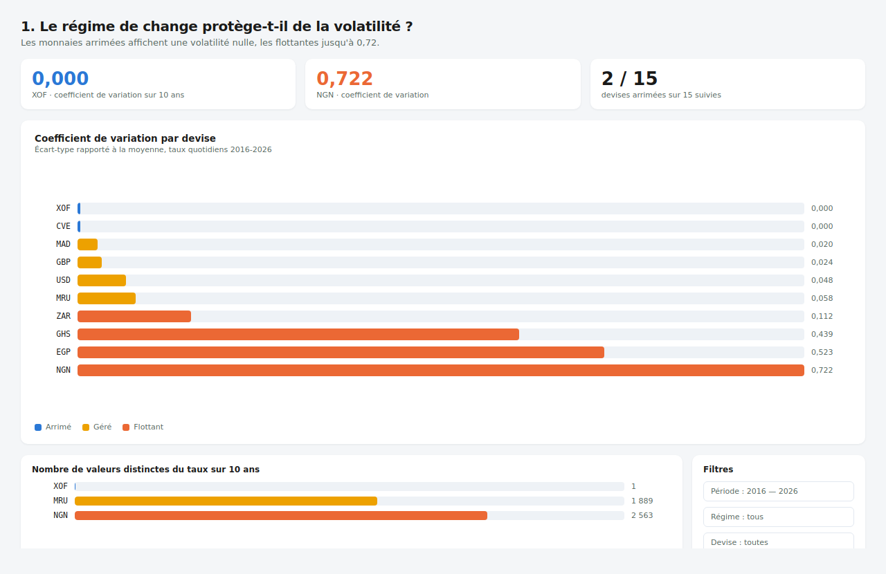

# Questions métier et tableau de bord

Cinq questions, cinq pages de tableau de bord. Chaque section donne les colonnes
à utiliser, le type de graphique, et les résultats déjà mesurés pour vérifier que
la page dit vrai.

Toutes les données viennent du dataset `marts`. Ne jamais brancher un rapport sur
`marts_staging`, qui ne sert qu'à dbt.

---

## Palette commune

Quatre couleurs, dans cet ordre, jamais réattribuées d'une page à l'autre :

| Rôle | Clair | Usage |
|---|---|---|
| Série 1 | `#2a78d6` | bleu — série principale, matières premières |
| Série 2 | `#eb6834` | orange — série de comparaison, actions |
| Série 3 | `#1baf7a` | vert d'eau — troisième série, indices |
| Série 4 | `#eda100` | jaune — quatrième série |

Textes : `#1a1a19` pour les titres, `#5a6b64` pour les libellés secondaires.
Fond des cartes : blanc. Grilles et axes en `#e2e8f0`, jamais plus foncé.

Une couleur suit toujours la même entité. Si un filtre retire une série, les
autres gardent leur teinte.

---

## 1. Le régime de change protège-t-il de la volatilité ?

**Le message** : les monnaies arrimées ont une volatilité nulle, les flottantes
non. C'est la question qui porte le sujet, mets-la en première page.

**Données** : `dim_devise`

| Colonne | Rôle |
|---|---|
| `devise_id` | dimension |
| `regime` | dimension de découpage |
| `coefficient_variation` | métrique |

**Graphique** : barres horizontales, une par devise, triées par coefficient
croissant. Couleur par `regime`.

- `arrime` → `#2a78d6`
- `gere` → `#eda100`
- `flottant` → `#eb6834`
- `reference` → gris `#94a3b8`

Barres horizontales et non verticales : les noms de devises se lisent
naturellement, et l'écart entre 0,00 et 0,72 saute aux yeux.

**Résultats à retrouver**

| Devise | Coefficient | Régime |
|---|---|---|
| XOF, CVE | 0,000 | arrimé |
| MAD | 0,020 | géré |
| MRU | 0,058 | géré |
| NGN | 0,722 | flottant |

**Trois chiffres clés** à poser au-dessus du graphique : `0,000` pour le XOF,
`0,722` pour le NGN, et l'écart entre les deux.

---

## 2. Quelle classe d'actif est la plus volatile ?

**Données** : `fct_cotation_journaliere` × `dim_instrument` × `dim_temps`

| Colonne | Rôle |
|---|---|
| `dim_temps.annee` | axe des abscisses |
| `dim_instrument.classe_actif` | série |
| `écart-type de variation_pct` | métrique |

**Graphique** : courbes, une par classe d'actif, sur dix ans.

- Matières premières → `#2a78d6`
- Actions → `#eb6834`
- Indices → `#1baf7a`

Traits de 2 px, points de 8 px minimum. Étiqueter directement les trois courbes
en bout de ligne plutôt que par une légende séparée.

**Le piège** : la volatilité se calcule sur `variation_pct`, jamais sur
`cloture_eur`. Un écart-type des prix comparerait Kosmos à 2 € et Anglo American
à 800 €, ce qui n'a aucun sens.

Dans Looker Studio, créer un champ calculé : `STDDEV(variation_pct)`.
Dans Power BI : `ECARTYPE.PARTITION(fct[variation_pct])`.

---

## 3. Quel pays a le panier d'exportation le plus exposé ?

**Données** : `fct_exportations_pays`, jointe à `dim_instrument` par
`categorie_export`

| Colonne | Rôle |
|---|---|
| `pays` | dimension |
| `categorie_export` | sous-dimension |
| `part_exportations` | métrique |
| `annee` | filtre |

**Graphique** : barres empilées horizontales, une barre par pays, segments par
catégorie. Un espace de 2 px entre segments.

**Ne jamais joindre cette table à `fct_cotation_journaliere`.** Les grains sont
incompatibles (pays × catégorie × année contre instrument × jour). Le lien passe
par `categorie_export`, présent des deux côtés.

**Résultats 2024**

| Pays | Catégorie dominante | Part |
|---|---|---|
| Mauritanie | Métaux | 33,7 % |
| Sénégal | Énergie | 32,7 % |
| Sénégal | Alimentaire | 21,6 % |

Ajouter un filtre sur `annee` pour montrer l'évolution 2015-2024.

---

## 4. Les sociétés extractives suivent-elles leur matière ?

**Données** : `fct_cotation_journaliere`, deux instruments comparés

**Graphique** : nuage de points. Variation quotidienne de l'action en abscisse,
variation de la matière en ordonnée. Un point par jour.

Ajouter une droite de tendance. Plus les points s'alignent, plus la société suit
son sous-jacent.

**Corrélations mesurées sur 2 500 jours**

| Paire | r |
|---|---|
| Kinross / Or | 0,616 |
| Endeavour / Or | 0,545 |
| Exxon / Brent | 0,534 |
| BP / Brent | 0,529 |
| Woodside / Brent | 0,504 |
| Barrick / Or | 0,214 |
| Kosmos / Gaz | 0,087 |
| **Orange / Or (témoin)** | **0,043** |

Le témoin est ce qui rend la page convaincante. Orange n'a aucun rapport avec
l'or, et sa corrélation est nulle : les 0,6 des sociétés minières ne sont donc
pas un artefact.

Deux cas méritent un commentaire : Barrick est diversifiée au-delà de l'or, et
Kosmos exploite du gaz qui n'est pas coté sur la référence américaine.

**Mise en page** : une grille de six nuages de points côte à côte, même échelle
partout, plutôt qu'un seul graphique avec un sélecteur.

---

## 5. Quelles ont été les périodes de tension ?

**Données** : `fct_cotation_journaliere` × `dim_temps`

**Graphique** : histogramme mensuel de l'écart-type des variations, sur dix ans.
Une seule série, en `#2a78d6`. Colorer en `#e34948` les mois qui dépassent trois
fois la médiane.

**Résultats**

| Mois | Volatilité |
|---|---|
| 2020-04 | 12,29 |
| 2020-03 | 7,19 |
| 2018-02 | 4,92 |
| 2025-04 | 4,29 |

Le pic d'avril 2020 est le krach du Covid. Le nommer dans une annotation : ça
prouve que les données décrivent le monde réel.

Sous le graphique, un second visuel : la volatilité par classe d'actif pendant
mars et avril 2020.

| Classe | Volatilité |
|---|---|
| Actions | 6,90 |
| Indices | 6,72 |
| Matières premières | 4,35 |

---

## Construire le rapport dans Looker Studio

**Connexion**

1. lookerstudio.google.com, *Créer* puis *Rapport*
2. Connecteur **BigQuery**, projet `crucial-bonsai-418120`
3. Dataset `marts`, une source par table
4. Répéter pour les 5 tables

**Jointures** : *Ressource* → *Gérer les sources* → *Fusionner les données*.
Joindre `fct_cotation_journaliere` à `dim_instrument` sur `instrument_id`, et à
`dim_temps` sur `date_cotation = date_jour`. Type *Left outer*.

**Champs calculés utiles**

```
Volatilite      STDDEV(variation_pct)
Amplitude       AVG(ABS(variation_pct))
Mois            FORMAT_DATETIME("%Y-%m", date_cotation)
```

**Réglages à ne pas oublier**

- *Style* → décocher les bordures et ombres des graphiques, garder les cartes plates
- Grille en `#e2e8f0`, épaisseur 1
- Format des nombres : 2 décimales pour les coefficients, 0 pour les volumes
- Une plage de dates commune en haut de chaque page, appliquée au rapport entier

## Construire le rapport dans Power BI

**Connexion** : *Obtenir les données* → *Google BigQuery* → connexion par compte
Google. Mode **Import** plutôt que DirectQuery : le volume est petit et le rapport
sera plus rapide.

Si la connexion directe pose problème, exporter les 5 tables en CSV depuis
BigQuery et les importer. C'est moins élégant mais ça déverrouille.

**Modèle** : dans la vue *Modèle*, relier `fct_cotation_journaliere` aux trois
dimensions. Cardinalité plusieurs-à-un, sens de filtre simple.

**Mesures DAX**

```
Volatilite = STDEV.P(fct_cotation_journaliere[variation_pct])
Amplitude = AVERAGEX(fct_cotation_journaliere, ABS([variation_pct]))
Correlation = ...  -- utiliser le visuel Nuage de points, pas une mesure
```

**Thème** : *Affichage* → *Thèmes* → *Personnaliser*. Coller les quatre couleurs
de la palette dans l'ordre.

## Mise en page commune

Cinq pages, une par question. Sur chaque page :

```
┌────────────────────────────────────────────────┐
│  Titre de la question                          │
│  Une phrase qui donne la réponse               │
├────────────────────────────────────────────────┤
│  [chiffre clé]  [chiffre clé]  [chiffre clé]   │
├────────────────────────────────────────────────┤
│                                                │
│              graphique principal               │
│                                                │
├────────────────────────────────────────────────┤
│   graphique secondaire   │   filtres           │
└────────────────────────────────────────────────┘
```

La phrase sous le titre est ce qui distingue un tableau de bord d'une collection
de graphiques. Écrire « Les monnaies arrimées affichent une volatilité nulle,
les flottantes jusqu'à 0,72 » plutôt que « Volatilité par devise ».

## Maquette



À reproduire à l'identique pour la page 1, puis décliner sur les quatre autres :
même hauteur de bandeau, mêmes cartes de chiffres clés, même famille de couleurs.

La source est `diagramme/maquette.html`, modifiable si besoin.
